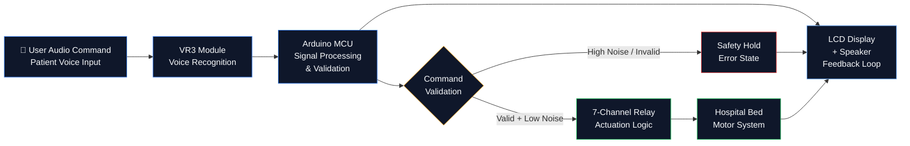

# MAXINE.v1 — Voice Activated Recovery Companion

**A Voice-Controlled Hospital Bed Interface for Quadriplegic Patients**  
*Restoring Physical Autonomy Through Human-Machine Interface Engineering*

> Developed through **Volunteers for Medical Engineering (VME)**  
> **Lead Systems & Design Engineer:** Amelia Arabe | Team: 4 Cross-Functional Engineers  
> Institution: Loyola University Maryland | Status: Benchtop-Validated Prototype ✓

---

## The Mission: Cura Personalis

*Cura Personalis* — care for the whole person — is not an abstraction. For a quadriplegic patient in a hospital bed, the inability to independently adjust head elevation, leg position, or call for help is not a medical inconvenience. It is a daily erosion of dignity and autonomy.

Existing hospital bed controls require manual dexterity. Standard call systems require physical button access. For patients with cervical spinal cord injuries, ALS, or advanced neuromuscular conditions, these interfaces are inaccessible by design — not by necessity.

**MAXINE.v1 was built to close this gap.**

The clinical need was identified in direct partnership with **Volunteers for Medical Engineering (VME)**, an organization dedicated to engineering solutions for individuals with physical disabilities. VME provided the problem statement, clinical context, and validation framework. MAXINE provides the answer.

---

## System Architecture: The Dual-Enclosure Interface

MAXINE's hardware is organized around a deliberate architectural separation — a **Dual-Enclosure Interface** that isolates user-facing communication from safety-critical actuator control.

```
┌─────────────────────────────────────────────────────────────────┐
│                    MAXINE.v1 SYSTEM OVERVIEW                     │
├─────────────────────────────┬───────────────────────────────────┤
│  TOP BOX — User Interface   │  BOTTOM BOX — Actuator Control    │
│  ─────────────────────────  │  ────────────────────────────── │
│  VR3 Voice Recognition      │  7-Channel Relay Logic Board      │
│  LCD Display (Feedback)     │  Hospital Bed Motor Interface     │
│  Speaker (Audio Confirm)    │  Actuator Signal Routing          │
│  Arduino (Signal Process)   │  Safety Interrupt Circuit         │
│  User-Facing Enclosure      │  High-Current Isolation Layer     │
└─────────────────────────────┴───────────────────────────────────┘
```

### Why Dual Enclosure?

This separation is not aesthetic — it is a systems integrity decision. Isolating the user interface layer from the relay actuation layer provides:

1. **Electrical Safety** — high-current relay switching is physically separated from the patient-facing enclosure
2. **Maintenance Clarity** — subsystems can be serviced independently without exposing the full circuit
3. **Scalability** — the top box interface can be upgraded (display, voice module, connectivity) without redesigning the actuator layer
4. **Clinical Compliance** — separation reduces EMI interference between voice processing and relay switching

---

## Technical Stack

### Core Hardware

| Component | Function | Specification |
|---|---|---|
| **Arduino Microcontroller** | Central processing unit | Signal arbitration, command routing, safety logic |
| **VR3 Voice Recognition Module** | Audio command capture | Speaker-dependent, digital signal output |
| **7-Channel Relay Logic Board** | Actuator control | Isolated switching for 7 independent bed functions |
| **16×2 LCD Display** | Real-time user feedback | Command echo, system status, error states |
| **Speaker Module** | Audio confirmation | Voice acknowledgment of received commands |
| **Dual Enclosure** | Physical architecture | User interface / actuator isolation |

### Command Set

| Voice Command | Function | Relay Channel |
|---|---|---|
| `"HEAD UP"` | Raise head section | CH-1 |
| `"HEAD DOWN"` | Lower head section | CH-2 |
| `"FEET UP"` | Raise foot section | CH-3 |
| `"FEET DOWN"` | Lower foot section | CH-4 |
| `"BED UP"` | Raise full bed height | CH-5 |
| `"BED DOWN"` | Lower full bed height | CH-6 |
| `"CALL HELP"` | Safety interrupt / nurse call | CH-7 |

### Firmware Architecture

```cpp
// MAXINE.v1 Command Processing Loop (Embedded C++)
void loop() {
  if (voiceModule.available()) {
    int command = voiceModule.read();
    validateCommand(command);       // Safety check layer
    echoToDisplay(command);         // LCD + speaker confirmation
    activateRelay(command);         // Relay actuation
    logEvent(command);              // Audit trail
  }
  checkSafetyInterrupt();          // Continuous safety polling
}
```

### Signal Flow



---

## Reliability Engineering: Performance & Validation

### Accuracy Metrics

| Test Environment | Command Recognition Accuracy | Sample Size |
|---|---|---|
| Low-noise (clinical room) | **10/10 (100%)** | 70 commands |
| Moderate ambient noise | **9/10 (90%)** | 70 commands |
| High-noise environment | **Safety protocol engaged** | — |

### Safety Architecture

MAXINE.v1 was designed with a **defense-in-depth** safety philosophy:

**Layer 1 — Recognition Threshold**  
The VR3 module is configured with a confidence threshold below which commands are rejected rather than approximated. An uncertain command produces no actuation.

**Layer 2 — Command Validation**  
The Arduino validates every received signal against the known command set before routing to any relay channel. Unrecognized signals trigger a hold state.

**Layer 3 — High-Noise Protocol**  
In environments where ambient noise exceeds reliable recognition thresholds, the system enters a conservative safety hold. The LCD displays the noise state. No unintended actuation occurs.

**Layer 4 — CALL HELP Interrupt**  
Channel 7 is a hardwired safety interrupt — reserved exclusively for the nurse call function. It is accessible even when other channels are in hold state, ensuring emergency access is never blocked by system constraints.

**Layer 5 — Feedback Loop**  
Every command — successful or failed — produces an LCD display response and speaker confirmation. The patient always knows the system state. No silent failures.

### Benchtop Validation Summary

- ✓ All 7 relay channels actuated correctly across full command set
- ✓ LCD display accurately echoed all received commands in real time  
- ✓ Speaker confirmation triggered on every successful recognition event
- ✓ Safety hold engaged reliably under simulated high-noise conditions
- ✓ CALL HELP interrupt accessible independently of all other system states
- ✓ Clinically reviewed through Volunteers for Medical Engineering

---

## Project Leadership: Roadmapping Idea to Execution

### My Role as Lead Systems & Design Engineer

**Problem Definition & Clinical Partnership**  
Worked directly with Volunteers for Medical Engineering to understand the clinical gap, define the patient population (quadriplegic patients with limited or no upper extremity function), and establish validation criteria grounded in real-world clinical use.

**System Architecture Design**  
Designed the Dual-Enclosure Interface architecture — the decision to separate user-facing communication from relay actuation was mine, driven by safety, maintainability, and clinical compliance requirements.

**Cross-Functional Team Leadership**  
Led a team of 4 engineers across hardware design, embedded firmware, enclosure fabrication, and system testing. Structured weekly syncs, maintained a shared task board, and coordinated integration milestones across all workstreams.

**Safety Protocol Engineering**  
Designed the layered safety architecture — recognition threshold, command validation, noise protocol, and CALL HELP interrupt — as a unified system rather than independent features.

**Validation & Documentation**  
Owned the validation framework: defined test conditions, ran command accuracy trials across noise environments, documented failure modes, and produced the final design package for VME clinical review.

### Development Lifecycle

```
Problem Statement received from VME
        ↓
Clinical requirements definition & patient user research
        ↓
Dual-Enclosure architecture design & component selection
        ↓
Embedded C++ firmware development — command parsing, relay routing, safety logic
        ↓
VR3 voice training — speaker-dependent command set registration
        ↓
Hardware assembly — enclosure fabrication, relay wiring, LCD integration
        ↓
Benchtop validation — 10/10 accuracy confirmed, safety protocols tested
        ↓
Clinical documentation delivered to Volunteers for Medical Engineering
```

---

## MAXINE.v2 — Roadmap

The benchtop-validated prototype establishes the hardware proof of concept. MAXINE.v2 targets clinical deployment readiness:

| Feature | Status |
|---|---|
| Speaker-independent voice recognition | Planned |
| Wireless / Bluetooth bed interface | Planned |
| Mobile app companion (iOS/Android) | Concept stage |
| Multi-patient profile support | Concept stage |
| EMR integration hook | Future research |
| IEC 60601 medical device compliance | Future work |

---

## Open Source

MAXINE is an open source project. The clinical need this device addresses is too important to be proprietary.

Hospitals should be able to deploy it. Researchers should be able to improve it. Engineers should be able to learn from it. Patients should benefit from it regardless of institutional budget.

---

## Repository Structure

```
maxine-v1/
├── README.md
├── firmware/
│   ├── maxine_v1.ino              # Main Arduino sketch
│   ├── command_parser.cpp         # VR3 signal parsing
│   ├── relay_controller.cpp       # 7-channel relay logic
│   ├── safety_layer.cpp           # Safety interrupt & validation
│   └── display_feedback.cpp       # LCD + speaker output
├── hardware/
│   ├── schematics/                # Circuit diagrams
│   ├── enclosure/                 # CAD files for dual-enclosure
│   └── bom.csv                    # Bill of materials
├── validation/
│   ├── test_protocol.md           # Command accuracy test methodology
│   ├── results_lownoise.csv       # 10/10 accuracy data
│   └── safety_audit.md           # Safety layer validation log
└── docs/
    ├── design_package.pdf         # Final design documentation
    └── vme_brief.md               # VME clinical context
```

---

## Technologies


---

## Clinical Context

**Partner Organization:** Volunteers for Medical Engineering (VME)  
**Patient Population:** Quadriplegic patients and individuals with severe upper extremity dysfunction  
**Clinical Setting:** Hospital bed environment  
**Validation Status:** Benchtop-validated prototype  
**Open Source License:** MIT

---

*Built for the patient who cannot reach the button.*  
*Engineered to restore what injury takes away.*
